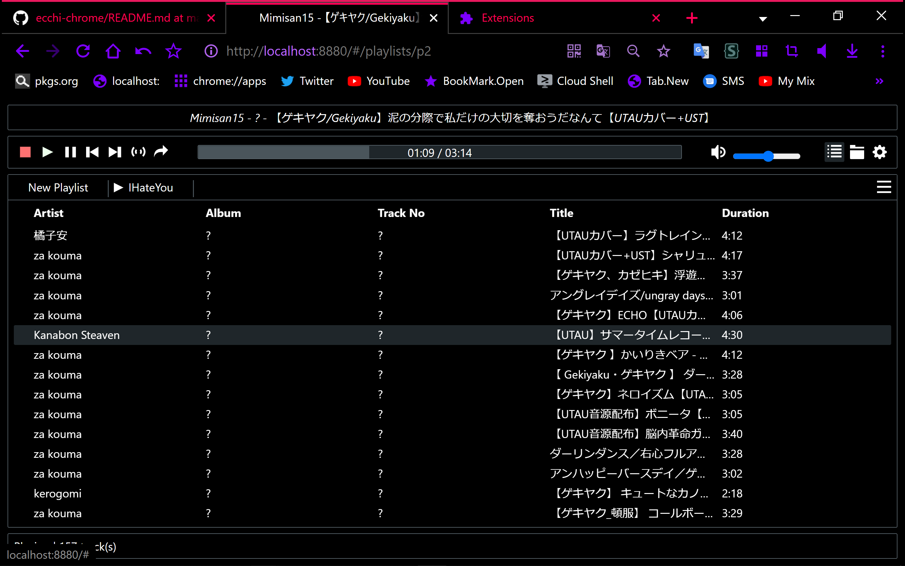
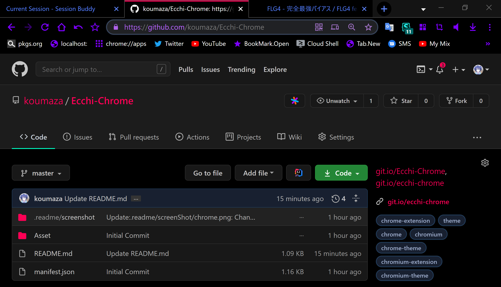

# Ecchi! on Chrome(Chromium)
<table align="left" border="0">
  <td colspan=0 align="left"> 

  <b>* </b> 
  <b>• ─</b> <a alt="Screenshot"			href="https://github.com/koumaza/Ecchi-Chrome#-"							>Screenshot</a> 
  <b>• ─</b> <a alt="How to Install"	href="https://github.com/koumaza/Ecchi-Chrome#how-to-install"	>How to Install</a>
  </td>
</table>  

## <!-- ScreenShot -->    

## How to Install
### 1. Download this extension
### 1-A-1. Download __`Source code (zip)`__
From: [_`github.com/koumaza/ecchi-chrome/releases/`_](https://github.com/koumaza/ecchi-chrome/releases/)
### 1-A-2. Unpack it
I don't know your using OS. But it have built-in extract function, if you using Windows or MacOS.
Or if your using Linux, there are `p7zip`, `unzip` etc...
### 1-B. Clone this repository
### 3. Install it
#### 3-1. Open _`chrome://extension`_
> Windows > Press `Ctrl` + `Shift` + `X`  
> Linux > Press `Ctrl` + `Shift` + `X`  
> MacOS > IDK
#### 3-2. Turn on __`Developer mode`__
#### 3-3. Press __`Load unpacked`__, then select unpacked directory or cloned directory to Install
